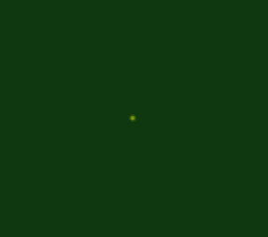
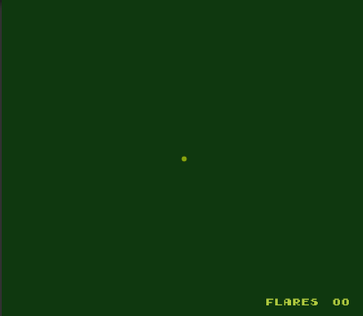

# ruins-of-atlantis

Made for GBJAM8. My first game jam entry ever.

**TODO**
- Make walls fade to dark after a while
- Some background sprites for UI elements
- “Currents” to hint shorter routes to goal
- Sound effects for shooting and hitting
- Traps & enemies

Some notes form my progress:

Saturday / Day 1
- Shooting script (object pooling)
- Player movement

Sunday / Day2
- Wall sprite
- Flare collisions with walls
- Animation for wall’s appearance
- Prefab brush for walls (link?)

Monday / Day 3
- Boxcast
- Problems with player speed: player gets stuck to walls when adding player speed
- Making player hitbox ⅕ of an unit so it can fit from spaces size of 1 unit
- Camera Follow script
- Canvas & Text + Pixel Perfect camera = not a good idea
- Added font: https://www.dafont.com/early-gameboy.font
- Camera follow shakes UI text and the player (so far player is not a properly imported sprite and doesn’t move “pixel perfect”)
- Should I just forget Camera Follow and make mazes in multiple “rooms”?

Tuesday / Day 4
- Fixed speed so that player doesn’t get stuck to walls (add speed to moveDelta, not to transform)
- Disabling Pixel Perfect Camera to try out UI elements (permanently perhaps? we’ll see). Changing display to match Game Boy aspect ratio.
- Visible Flare-counter

Wednesday / Day 5
- Making a repository to GitHub
- Changing levels with SceneManager.

Thursday / Day 6
- Other stuff to do...

Friday / Day 7
- Flare & Player sprites
- Oxygen bar (I wish I could have made this "pixel perfect" but I guess time is running out)

Saturday / Day 8
- Goal can be reached only by player and shooting it makes it visible and animated
- Level2

Sunday / Day 9
- Level 3
- Win/Lose screens and SceneManager to operate them
- First attempts for WebGL builds and canvas sizes. Have to settle with least bad option...
